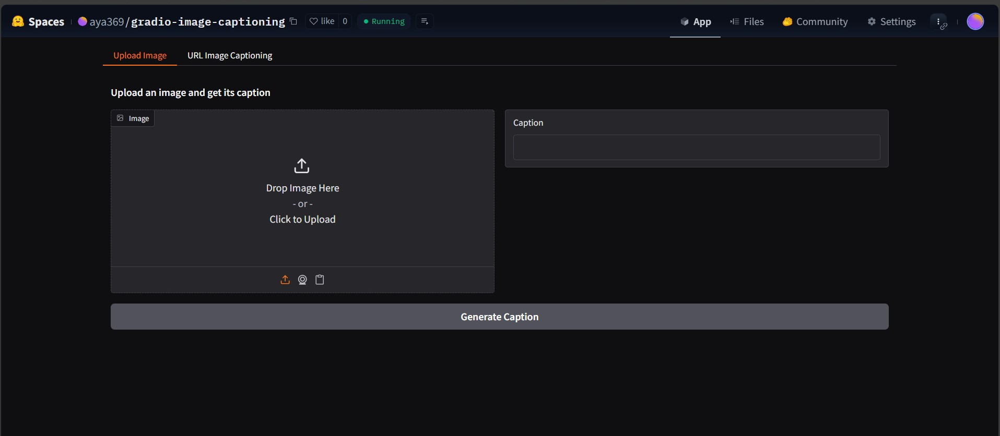

# Gradio Image Captioning



**Author:** Aya Alhamwe  
**Platform:** Hugging Face Spaces | Python | Gradio | Transformers (BLIP)  

---

## 📖 Project Overview

**Gradio Image Captioning** is a powerful AI application for automatically generating descriptive captions for images. It leverages **Salesforce’s BLIP (Bootstrapped Language-Image Pretraining) model** and provides an intuitive interface via **Gradio**.  

This project demonstrates:
- Image captioning for uploaded images  
- Automatic captioning of all images on a webpage URL  
- End-to-end pipeline deployment on Hugging Face Spaces  

The project is designed for learning and experimentation, allowing users to see how AI can understand visual content and generate natural language descriptions.

---

## 🚀 Features

- **Upload Image Tab**: Generate captions for a single uploaded image.  
- **URL Image Captioning Tab**: Automatically fetch all images from a webpage and generate captions.  
- **Interactive Gradio Interface**: Friendly GUI for testing AI models without coding.  
- **Professional Project Structure**: Modular Python code, organized for scalability.  

---

## 📂 Project Structure

```text
Gradio-Image-Captioning/
│
├── app.py                  # Main Gradio interface
├── captioning/             # Modular captioning functions
│   ├── __init__.py         # Package initialization
│   ├── image_caption.py    # Function for single image captioning
│   └── url_caption.py      # Function for webpage image captioning
├── requirements.txt        # Python dependencies
├── .gitignore              # Git ignore rules
├── .gitattributes          # Git LFS attributes for large files
└── README.md               # Project documentation

├── README.md               # Project documentation
└── .gitignore              # Git ignore rules
```

⚙️ Installation

To run this project locally, follow these steps:

Clone the repository

```
git clone https://github.com/Aya-Alhamwe/Gradio-Image-Captioning.git
cd Gradio-Image-Captioning
```

Create a virtual environment (optional but recommended)

```
python -m venv venv
source venv/bin/activate       # MacOS/Linux
venv\Scripts\activate          # Windows
```

Install dependencies

```
pip install -r requirements.txt
```

🖥 Running the App Locally

```
python app.py
```

Open your browser at http://127.0.0.1:7860 (default Gradio port)

Use the Upload Image tab to test single images

Use the URL Image Captioning tab to generate captions from a webpage

🌐 Deployment on Hugging Face Spaces

The project is already deployed at:
Gradio Image Captioning Space

No local installation required

Interactive interface runs directly in the browser

Auto-updates whenever code is pushed to the linked GitHub repository

🛠 Technology Stack

Python 3.10 – Core programming language

Gradio 5.42 – Interactive GUI library

Transformers (BLIP) – Pretrained image captioning model

Pillow & NumPy – Image processing

Requests & BeautifulSoup4 – Web scraping for URL images

🔧 How It Works

Image Upload: The user uploads an image → converted to RGB → processed with BLIP → caption generated.

Webpage URL: The user inputs a URL → HTML is fetched → images are filtered by size → processed with BLIP → captions returned.

Gradio Interface: Two tabs allow easy access and interaction, making AI accessible without code.

📄 Requirements
```
gradio[oauth,mcp]==5.42.0
transformers
torch
Pillow
numpy
requests
beautifulsoup4
```

Additional dependencies can be installed via requirements.txt.

🧩 Contribution

Contributions are welcome!
To contribute:

Fork the repository

Create a feature branch (git checkout -b feature-name)

Commit your changes (git commit -m "Add new feature")

Push to the branch (git push origin feature-name)

Create a Pull Request

📌 License

This project is licensed under MIT License – see LICENSE
 for details.

🎯 Learning Outcomes & Skills Demonstrated

Modular Python coding and package structure (__init__.py, multiple Python modules)

Hugging Face Spaces deployment and GitHub integration

Image processing and AI caption generation with BLIP model

Building interactive web apps with Gradio

Professional documentation suitable for CV and portfolio
